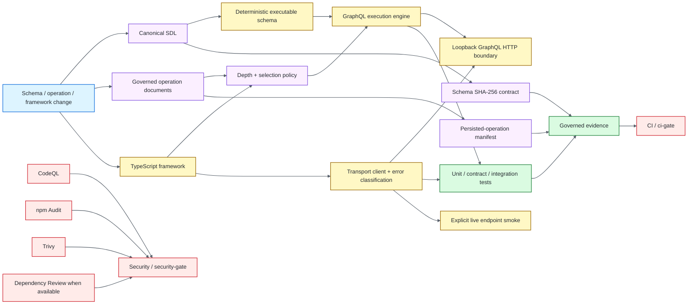

# GraphQL Quality Engineering Framework

[](https://github.com/portyu9/qa-automation-graphql/actions/workflows/ci.yml)
[](https://github.com/portyu9/qa-automation-graphql/actions/workflows/security.yml)
[](https://github.com/portyu9/qa-automation-graphql/actions/workflows/docs.yml)
[](https://github.com/portyu9/qa-automation-graphql/actions/workflows/live-smoke.yml)

[](https://www.graphql-js.org/)
[](https://www.typescriptlang.org/)
[](https://vitest.dev/)
[](https://nodejs.org/)
[](docs/schema-evolution.md)
[](docs/graphql-testing.md)
[](https://github.com/features/actions)
[](https://trivy.dev/)
[](LICENSE)
[](SECURITY.md)

A TypeScript GraphQL quality-engineering framework for **schema contracts, execution semantics, authorization, pagination, abstract types, operation governance, persisted-operation identity, HTTP transport behavior, and deterministic CI evidence**. The framework deliberately tests GraphQL at the lowest layer that can conclusively prove a requirement instead of turning every contract into a network-level end-to-end request.

> [!IMPORTANT]
> GraphQL correctness is multi-dimensional. A schema can parse while a resolver violates nullability; an operation can execute while exceeding policy; an HTTP request can succeed while carrying GraphQL errors; and a persisted operation can remain syntactically valid while its identity drifts. The framework keeps those failure domains separate so each has attributable evidence.

**Read by intent:** [quality model](#quality-model) · [architecture](#architecture) · [schema governance](#schema-governance) · [operation governance](#operation-governance) · [transport](#transport-contracts) · [local qualification](#local-qualification) · [live boundary](#live-smoke-boundary) · [CI/security](#ci-conclusions) · [repository map](#repository-map)

## Quality model

| Validation plane | What it proves | Default execution | Primary evidence |
| --- | --- | --- | --- |
| Schema contracts | Canonical SDL shape, interfaces, unions, introspection and committed schema identity | GraphQL.js + deterministic schema build | Schema assertions + SHA-256 baseline |
| Execution semantics | Variables, nullability, resolver behavior, mutations, authorization and abstract-type resolution | In-memory deterministic service | Vitest assertions |
| Pagination | Cursor behavior and connection semantics | Deterministic domain/service data | Contract assertions |
| Operation policy | Depth and selection-count limits before execution | Parsed GraphQL AST | Policy assertions |
| Persisted operations | Named operation documents remain bound to committed SHA-256 identities | Manifest generation/check | Committed operation manifest |
| HTTP transport | Network, HTTP, malformed protocol, GraphQL execution and redaction boundaries | Loopback HTTP server | Integration assertions |
| Evidence contract | Intended 23 deterministic tests executed with governed coverage | Vitest JUnit + V8 coverage validators | JUnit + coverage evidence |
| Runtime compatibility | Primary Node qualification remains compatible with additional Node runtime | Separate CI lanes | Stable `ci-gate` |
| Security | Source, advisory, repository/dependency/configuration/secret and PR dependency-change signals | CodeQL + npm Audit + Trivy + Dependency Review when available | Stable `security-gate` |
| Live endpoint | Explicit external endpoint connectivity/query boundary | Manual/opt-in workflow | Live-smoke conclusion |

## Architecture



The architecture separates canonical contracts from runtime and transport concerns. `schema/` is the committed SDL source of truth; `src/schema/` builds the deterministic executable service; `src/policy/` owns operation limits; `src/manifest/` owns stable identities; `src/client/` classifies transport/protocol/GraphQL failures; and `src/server/` supplies the loopback HTTP boundary. See [Architecture](docs/architecture.md).

## Engineering invariants

| Concern | Framework contract |
| --- | --- |
| Canonical schema | The committed SDL is the schema source of truth; compiled runtime location must not redefine where it is loaded from. |
| Schema drift | A SHA-256 baseline is committed and CI regenerates/compares it fail-closed. |
| Operation identity | Persisted named operations are normalized into a committed manifest with exact document fingerprints. |
| Operation limits | Depth and selection-count policy is evaluated from the parsed document before execution. |
| Execution semantics | Nullability, variables, authorization, mutations, pagination and abstract types are proved independently from HTTP transport. |
| Transport classification | Network failure, non-success HTTP, malformed GraphQL protocol, and GraphQL execution errors remain distinct error classes. |
| Redaction | Transport diagnostics do not casually surface authorization or other secret-bearing values. |
| Determinism | Required CI owns an in-memory/loopback service; public GraphQL services are not framework-health dependencies. |
| Live endpoints | External smoke requires explicit opt-in and environment configuration and is not represented as pull-request deterministic coverage. |
| Test evidence | A passing command is insufficient; JUnit identity/count and coverage evidence are validated after execution. |
| Runtime support | primary Node runtime is the primary qualification line and additional Node runtime is an explicit compatibility line. |
| Supply chain | Actions are immutable-pinned; CodeQL, npm Audit, Trivy, and Dependency Review remain separate controls. |

## Toolchain

| Component | Qualified version / policy |
| --- | --- |
| Node.js | 24.20.0 primary; additional Node compatibility lane |
| npm | 11.19.1 |
| GraphQL.js | 17.0.2 |
| TypeScript | 7.0.2 with strict contracts including `exactOptionalPropertyTypes` |
| Vitest | 4.1.11 |
| Coverage | V8 through `@vitest/coverage-v8` 4.1.11 |

The repository engine range is intentionally bounded to supported Node lines rather than silently accepting an unqualified future major.

## Schema governance

The canonical SDL is versioned independently from the TypeScript build output. `schema:check` builds the framework, loads the repository-owned SDL through an explicit root-relative contract, generates the current schema fingerprint, and compares it with the committed baseline.

```bash
npm run schema:check
```

An intentional schema change refreshes the baseline explicitly:

```bash
npm run schema:refresh
npm run schema:check
```

That distinction matters: printing a hash to logs is observability; comparing regenerated state against a committed expected identity is governance. See [Schema evolution](docs/schema-evolution.md).

Schema compatibility should still be reviewed semantically. A stable fingerprint proves the schema did not change; a changed fingerprint proves only that it did. Whether a schema evolution is additive, breaking, operationally safe, or intentionally deprecated requires GraphQL-aware review.

## Operation governance

The framework binds named operations in `operations/` to a committed manifest. Each governed document receives an exact SHA-256 identity so accidental edits, replacement queries, or stale persisted-operation mappings cannot pass merely because the document still parses.

```bash
npm run manifest:check
```

Intentional operation changes refresh the manifest explicitly:

```bash
npm run manifest:refresh
npm run manifest:check
```

The policy layer also measures operation depth and selection count before execution. Those metrics are deterministic AST contracts rather than server timing heuristics, making them suitable for fail-fast query-complexity policy. See [GraphQL testing](docs/graphql-testing.md) and [Security and limits](docs/security-and-limits.md).

## Transport contracts

The client layer keeps the HTTP boundary honest by distinguishing conditions that are often collapsed into one generic request failure:

- network/connectivity failure;
- non-success HTTP status;
- malformed or non-GraphQL response shape;
- successful HTTP transport carrying GraphQL `errors`;
- successful GraphQL data response.

Integration tests use the repository-owned loopback server so real serialization/protocol behavior is exercised without public network variability. Sensitive transport details are sanitized rather than copied indiscriminately into diagnostics.

## Local qualification

Install the exact dependency graph and run the same deterministic quality surface used by primary CI:

```bash
npm ci --ignore-scripts --no-audit --no-fund
npm run quality
```

Useful focused commands:

```bash
npm run typecheck
npm run test:unit
npm run test:integration
npm run test:coverage
npm run schema:check
npm run manifest:check
npm run docs:check
npm run workflow-pins:check
```

The governed deterministic suite contains **23 tests** across unit, contract, and integration layers. CI validates not just process success but JUnit identities/counts and coverage floors so accidental discovery loss cannot masquerade as a green run.

## Live smoke boundary

External GraphQL execution is explicit opt-in evidence, not a hidden prerequisite for framework health.

```bash
cp .env.example .env
# export required values through the shell or a secret manager
RUN_LIVE_GRAPHQL=true npm run test:live
```

The dedicated live Vitest configuration includes only the live-smoke surface that deterministic CI excludes. The `live-smoke` workflow remains manual so endpoint availability, authentication, authorization, data mutation policy, rate limits, tenancy, and environment ownership can be supplied intentionally.

See [Live endpoint](docs/live-endpoint.md).

## CI conclusions

The stable repository-facing conclusions are `CI / ci-gate`, `docs / docs-contract`, and `Security / security-gate`.

- `ci.yml` — repository/docs/workflow-pin policy, strict types, 23-test deterministic execution, V8 coverage evidence, exact JUnit identity validation, schema fingerprint check, operation-manifest check, and additional Node compatibility.
- `docs.yml` — README structure, Mermaid, workflow badges, directory map, and documentation-reference contracts.
- `security.yml` — immutable Action policy, CodeQL JavaScript/TypeScript analysis, HIGH/CRITICAL npm Audit, attributed Trivy scanning, conditional pull-request Dependency Review, and stable aggregation.
- `live-smoke.yml` — explicit externally configured endpoint boundary only.

When GitHub Dependency graph is unavailable, the PR workflow records that limitation and keeps npm Audit plus Trivy active as repository-wide security gates. Those controls are deliberately not presented as equivalent to change-aware Dependency Review.

Dependabot maintains npm and GitHub Actions updates. Automated updates must clear the same deterministic and security gates as human-authored changes.

## Confidence boundaries

GraphQL quality is multi-dimensional: schema shape, operation governance, execution semantics, HTTP transport, persisted identity, authorization policy, and live-environment reachability are related but not interchangeable signals.

| Signal | Confidence gained | Deliberate limit |
| --- | --- | --- |
| SDL/schema contracts | The committed type system, nullability, fields, arguments, interfaces/unions, and structural invariants remain machine-valid | Schema validity does not prove resolver correctness, data quality, authorization, latency, or deployed-provider compatibility |
| Operation policy | Parsed operations obey repository governance such as naming, type restrictions, depth/selection rules, and other static constraints | Static operation admissibility does not prove the caller is authorized or the resolver will return correct runtime data |
| Deterministic execution tests | GraphQL execution semantics, variables, errors, abstract types, pagination behavior, and resolver-facing contracts execute against controlled data | In-process execution does not prove HTTP headers/status handling, proxies, TLS, authentication infrastructure, or a deployed service |
| HTTP client integration | POST serialization, headers, timeout/abort behavior, HTTP status handling, GraphQL error handling, and response-shape policy are executable | A controlled transport target does not prove production routing, upstream availability, or business correctness |
| Persisted-operation identity | Canonical operation text maps to a stable governed identity and manifest contract | Identity does not itself prove cache behavior, authorization, rollout coordination, or server-side persisted-query support |
| Authenticated-host binding | A bearer credential can only be emitted to an explicitly approved endpoint hostname | Destination authorization does not prove the remote service is trustworthy, uncompromised, correctly authorized, or semantically healthy |
| Manual live smoke | The configured protected environment can accept a minimal read-only GraphQL request through the real HTTP/auth boundary | A successful `__typename` probe is intentionally narrow: it is not full schema, resolver, authorization, mutation, performance, or dependency health |
| Semantic JUnit / schema / manifest evidence | CI proves governed tests and identity checks actually executed with expected attribution | Artifact presence alone is not proof; native conclusions, expected test identity, and evidence validation must agree |
| CodeQL / npm Audit / Trivy / dependency review | Independent controls inspect source, advisory, repository/configuration/secret, and dependency-diff risk planes | Green scanners are scoped evidence, not proof of vulnerability absence |

Use the **lowest boundary that can disprove the requirement**. Add the live endpoint only when the requirement depends on deployed transport or environment semantics; deterministic repository health should not depend on external availability.

## Repository map

Only directories are shown.

```text
.
├── .github/
│   ├── scripts/
│   └── workflows/
├── docs/
├── operations/
├── schema/
├── scripts/
├── src/
│   ├── client/
│   ├── domain/
│   ├── manifest/
│   ├── policy/
│   ├── schema/
│   └── server/
└── tests/
    ├── contract/
    ├── integration/
    ├── smoke/
    └── unit/
```

Root files own runtime/toolchain pins, dependency reproducibility, Vitest/TypeScript configuration, environment examples, contribution/security policy, and the command surface; they are intentionally omitted from the directory-only map.

## Failure triage

| Signal | First interpretation |
| --- | --- |
| Schema fingerprint mismatch | Canonical SDL changed without the committed schema baseline being intentionally refreshed/reviewed. |
| Manifest mismatch | Governed operation document identity drift. |
| Operation policy failure | Depth/selection budget exceeded before execution. |
| Resolver/execution failure | GraphQL semantic contract such as nullability, authorization, mutation or abstract type behavior. |
| Transport failure | Network, HTTP, protocol-shape, or GraphQL error-classification boundary. |
| JUnit evidence failure | The intended governed tests were not proven to have executed exactly as expected. |
| Coverage evidence failure | Instrumented framework surface dropped below governed floors or evidence is absent. |
| additional Node runtime-only failure | Runtime compatibility drift distinct from primary Node runtime primary qualification. |
| Live-smoke failure | External endpoint/configuration/service issue, not automatically a deterministic framework regression. |
| npm Audit / Trivy / CodeQL failure | Independent dependency, repository, or source-security signal. |

## Further documentation

- [Architecture](docs/architecture.md)
- [GraphQL testing](docs/graphql-testing.md)
- [Security and limits](docs/security-and-limits.md)
- [Schema evolution](docs/schema-evolution.md)
- [Live endpoint](docs/live-endpoint.md)
- [CI quality gates](docs/ci-quality-gates.md)
- [Contributing](CONTRIBUTING.md)
- [Security policy](SECURITY.md)

The framework optimizes for **contract ownership, deterministic failure attribution, governed schema/operation identities, and evidence that proves the intended checks actually executed**—not for maximizing the number of requests labeled end to end.