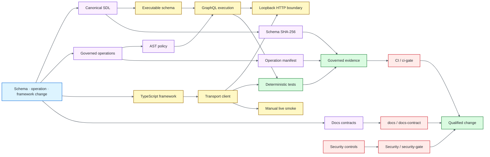

# GraphQL Quality Engineering Framework

[](https://github.com/portyu9/qa-automation-graphql/actions/workflows/ci.yml)
[](https://github.com/portyu9/qa-automation-graphql/actions/workflows/security.yml)
[](https://github.com/portyu9/qa-automation-graphql/actions/workflows/docs.yml)

[](https://www.graphql-js.org/)
[](https://www.typescriptlang.org/)
[](https://vitest.dev/)
[](https://nodejs.org/)
[](docs/schema-evolution.md)
[](docs/graphql-testing.md)
[](https://github.com/features/actions)
[](https://trivy.dev/)
[](LICENSE)
[](SECURITY.md)

A TypeScript GraphQL quality-engineering framework for **schema identity, execution semantics, authorization, pagination, operation policy, persisted-operation identity, HTTP transport classification, and deterministic evidence**. It uses the lowest layer that can conclusively prove each requirement instead of turning every contract into a network request.

> [!IMPORTANT]
> Schema validity, resolver correctness, static operation policy, HTTP success, GraphQL success, and persisted-operation identity are different signals. The framework keeps them separately attributable.

**Start here:** [quality model](#quality-model) · [architecture](#architecture) · [toolchain](#toolchain) · [schema governance](#schema-governance) · [operation governance](#operation-governance) · [CI conclusions](#ci-conclusions) · [documentation](#documentation)

## Quality model

| Plane | Primary boundary | What it proves |
| --- | --- | --- |
| Schema contracts | GraphQL.js + canonical SDL | Type-system shape and committed schema identity |
| Execution semantics | In-memory service | Variables, nullability, resolvers, mutations, auth, pagination, abstract types |
| Operation policy | Parsed AST | Depth and selection-count limits before execution |
| Persisted operations | Manifest generation/check | Named documents remain bound to exact SHA-256 identities |
| HTTP transport | Loopback GraphQL server | Serialization, HTTP/protocol/GraphQL failure classification |
| Evidence | Vitest JUnit + V8 validators | Governed tests and coverage actually executed |
| Runtime compatibility | Primary + additional Node lanes | Explicit supported-runtime qualification |
| Security | CodeQL + npm Audit + Trivy + Dependency Review | Independent source/dependency/repository/change-diff signals |
| Live endpoint | Manual opt-in | Narrow externally configured transport/auth boundary |

## Architecture



The root README retains only this architecture overview. Detailed ownership, execution/transport separation and the deeper color-coded contract flow are in [`docs/architecture.md`](docs/architecture.md).

## Engineering invariants

- **Canonical sources:** committed SDL and governed operation documents are explicit sources of truth.
- **Identity:** schema and persisted-operation SHA-256 contracts regenerate and compare fail-closed.
- **Policy before execution:** depth/selection limits are AST contracts, not timing heuristics.
- **Layered semantics:** resolver/nullability/auth/pagination behavior is proven independently from HTTP transport.
- **Transport attribution:** network, HTTP, malformed protocol and GraphQL execution errors remain distinct.
- **Determinism:** required CI uses in-memory/loopback execution, not public GraphQL services.
- **Live separation:** external smoke is explicit/manual and never substitutes for deterministic qualification.
- **Evidence semantics:** JUnit identities/counts and V8 coverage are validated after execution.
- **Supply chain:** workflow policy, CodeQL, npm Audit, Trivy and Dependency Review remain separate controls.

## Toolchain

| Component | Qualified version / policy |
| --- | --- |
| Node.js | 24.20.0 primary; additional Node compatibility lane |
| npm | 11.19.1 |
| GraphQL.js | 17.0.2 |
| TypeScript | 7.0.2 with strict contracts including `exactOptionalPropertyTypes` |
| Vitest | 5.0.0 |
| Coverage | V8 through `@vitest/coverage-v8` 5.0.0 |

The Node engine range is deliberately bounded to qualified lines rather than silently accepting an untested future major.

## Quick start

```bash
npm ci --ignore-scripts --no-audit --no-fund
npm run quality
```

Useful focused commands and evidence interpretation are in [`docs/operations.md`](docs/operations.md).

## Schema governance

The committed SDL has a generated SHA-256 identity checked in CI:

```bash
npm run schema:check
```

Intentional changes use `npm run schema:refresh` followed by `npm run schema:check`. Fingerprint drift proves the schema changed; compatibility and rollout safety still require semantic review. See [`docs/schema-evolution.md`](docs/schema-evolution.md).

## Operation governance

Named operations are bound to a committed manifest with exact SHA-256 identities, while depth and selection-count limits are evaluated from the parsed AST before execution.

```bash
npm run manifest:check
```

Intentional document changes use `npm run manifest:refresh` followed by `npm run manifest:check`. See [`docs/graphql-testing.md`](docs/graphql-testing.md) and [`docs/security-and-limits.md`](docs/security-and-limits.md).

## Transport contracts

The client distinguishes network failure, non-success HTTP, malformed GraphQL protocol, HTTP success with GraphQL `errors`, and successful data responses. Integration coverage uses the repository-owned loopback server so HTTP semantics are real without public-network variability.

Detailed transport and live-target operating guidance lives in [`docs/operations.md`](docs/operations.md) and [`docs/live-endpoint.md`](docs/live-endpoint.md).

## CI conclusions

The stable repository-facing conclusions are **`CI / ci-gate`**, **`docs / docs-contract`**, and **`Security / security-gate`**.

- `ci.yml` qualifies repository/runtime policy, strict types, the governed 23-test deterministic suite, V8 coverage evidence, schema identity, operation identity and additional Node compatibility.
- `docs.yml` validates README structure, badges, Mermaid styling, documentation references and the directory-only repository map.
- `security.yml` independently gates supply-chain policy, CodeQL, npm Audit, Trivy and pull-request Dependency Review when available.
- `live-smoke.yml` is the explicit externally configured endpoint boundary only.

See [`docs/ci-quality-gates.md`](docs/ci-quality-gates.md) and [`docs/operations.md`](docs/operations.md) for evidence semantics and failure interpretation.

## Repository map

```text
.
├── .github/
├── docs/
├── operations/
├── schema/
├── scripts/
├── src/
└── tests/
```

Only directories are shown; root files own runtime/toolchain pins and repository configuration.

## Documentation

| Guide | Use it for |
| --- | --- |
| [`docs/architecture.md`](docs/architecture.md) | Contract ownership, runtime/transport/evidence boundaries, deeper color-coded flow |
| [`docs/operations.md`](docs/operations.md) | Commands, identity lifecycle, transport/live execution, evidence, dependencies, triage |
| [`docs/graphql-testing.md`](docs/graphql-testing.md) | GraphQL execution, operation and persisted-document testing |
| [`docs/security-and-limits.md`](docs/security-and-limits.md) | Operation limits and security policy |
| [`docs/schema-evolution.md`](docs/schema-evolution.md) | Schema fingerprinting and evolution |
| [`docs/live-endpoint.md`](docs/live-endpoint.md) | Explicit external endpoint boundary |
| [`docs/ci-quality-gates.md`](docs/ci-quality-gates.md) | CI/evidence/security conclusions |
| [`CONTRIBUTING.md`](CONTRIBUTING.md) | Change-quality expectations |
| [`SECURITY.md`](SECURITY.md) | Security policy |

The framework optimizes for **contract ownership, deterministic failure attribution, governed schema/operation identities, and evidence that proves the intended checks actually executed**.
