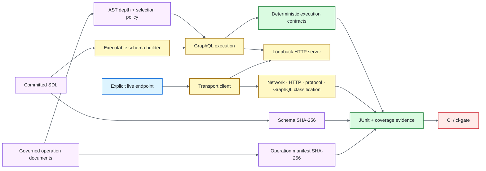

# Architecture

## Objective

The framework separates canonical GraphQL contracts from execution, transport, evidence and environment concerns. The design keeps schema and operation identity deterministic while introducing real HTTP only where protocol semantics matter.

## Contract ownership

- `schema/` is the committed SDL source of truth.
- `operations/` owns governed named operation documents.
- `src/schema/` builds the deterministic executable service.
- `src/policy/` applies static operation limits before execution.
- `src/manifest/` owns schema and operation identity generation.
- `src/client/` owns transport serialization, failure classification and redaction.
- `src/server/` owns the loopback HTTP boundary used by integration tests.

The framework does not make transport the default test layer. Schema, AST and execution contracts remain in-process unless the requirement specifically depends on HTTP behavior.

## Schema boundary

The canonical SDL is versioned independently from compiled TypeScript output. The schema contract loads that root-relative source, generates a SHA-256 fingerprint and compares it with the committed expected identity.

A fingerprint is an identity oracle, not a compatibility oracle. Compatibility review still owns additive/breaking changes, deprecation, resolver impact and rollout safety.

## Operation boundary

Named operation documents receive exact normalized SHA-256 identities in the committed manifest. The AST policy layer separately measures depth and selection count before execution.

Identity and admissibility remain different contracts: a document can be unchanged but violate a newly tightened policy, or satisfy static policy while failing runtime authorization/data semantics.

## Execution boundary

The deterministic service proves GraphQL semantics against controlled data: variables, nullability, authorization, mutations, pagination, interfaces/unions and resolver behavior. Those tests intentionally avoid network failure causes when transport is not material.

## Transport boundary

The loopback server introduces real HTTP serialization and response behavior without public-network variability. `src/client/` keeps four failure domains attributable:

1. network/connectivity;
2. non-success HTTP status;
3. malformed/non-GraphQL protocol shape;
4. valid HTTP carrying GraphQL execution errors.

Secret-bearing request details are sanitized rather than propagated into generic diagnostics.

## Evidence boundary

Vitest success is followed by repository-owned semantic validation of JUnit identity/count and V8 coverage evidence. Schema and operation identities are independently regenerated and compared.

This prevents a green process exit, an empty report or a renamed test surface from being treated as equivalent to the intended qualification work.

## Live environment boundary

External GraphQL execution is explicit and manually configured. The live-smoke path reuses the governed client boundary but is not a pull-request prerequisite because endpoint availability, authentication, authorization, tenancy, rate limits and data policy belong to the environment owner.

## Extension rules

New framework behavior should preserve these boundaries:

1. keep the committed SDL and operation documents as explicit sources of truth;
2. evaluate static operation policy before resolver execution;
3. prefer deterministic execution contracts when HTTP is not material;
4. use loopback transport for HTTP serialization/classification tests;
5. keep schema identity, operation identity and semantic compatibility as separate decisions;
6. retain failure-class attribution across network, HTTP, GraphQL protocol and GraphQL execution;
7. validate evidence semantically after test execution;
8. keep external endpoint use explicit and separately attributable.
